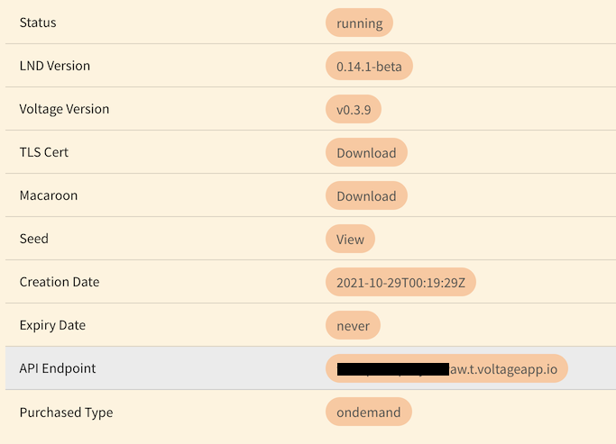
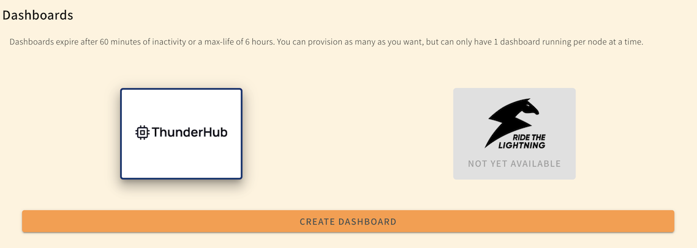
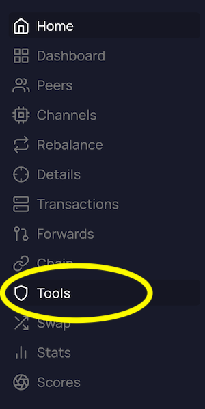
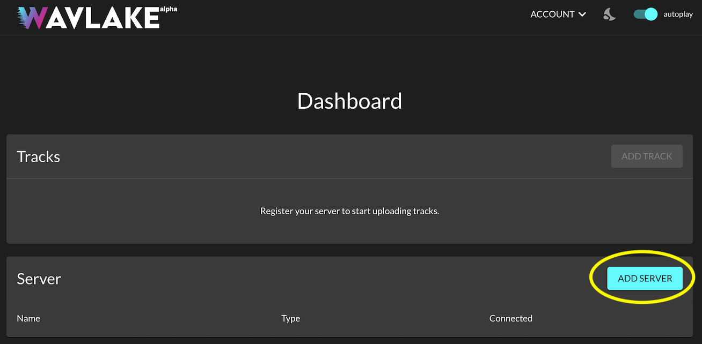
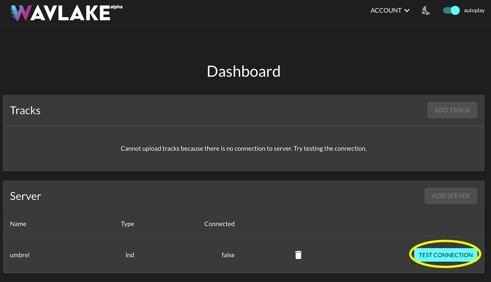

# Voltage

## Overview

This guide will walk you through the steps required to connect your Voltage/LND node to Wavlake.

The steps below will help you to 1) identify your LND's hostname and port, 2) generate/download a tls.cert file, and 3) generate/download a custom macaroon, all of which will give Wavlake limited permissions to create and check invoices directly on your node on your behalf. We advise keeping a notepad open on your computer while walking through this guide to keep track of the items you will need to register your server.

## 1. Hostname and Port

In order to interact with your Voltage node, Wavlake needs a publicly accessible address to reach it. Voltage provides this via each node's API endpoint.

Sign in to Voltage and go to the Info page for the node you would like to connect. There you will find the API Endpoint value. It should end with "voltageapp.io". Copy this value down. This is your hostname.

Voltage sets the LND port to 10009 by default. This is your port.


We currently do not support Voltage nodes running with IP Whitelisting enabled.


## 2. TLS Cert

The certificate file helps ensure that the connection between Wavlake and your Voltage node is [relatively secure](https://docs.lightning.engineering/lightning-network-tools/lnd/safety#tls). Voltage makes it easy to download this file by providing a "Download" link on the same Info page where we found the API Endpoint. Download the TLS Cert from the page.

## 3. Macaroon

The last item we need is a macaroon, which is a kind of key that allows you to perform specific actions on your LND instance. In order to give Wavlake only the minimum permissions needed to work with the site, we are going to custom "bake" a macaroon with those specific permissions only.

The simplest way to create a macaroon is by using the ThunderHub client. This app is available on Voltage through the "Dashboards" feature. Navigate to the "Dashboards" section, click on "ThunderHub", and "Create Dashboard".

Once ThunderHub is ready, open the application and log in. Find the "Tools" section in the left-hand navigation pane and click on it.

On the Tools page, you should see a "Bakery" section. Click on the "Bake" button and you will see a list of options appear.

Slide the following options to "Yes" (a visual guide is below): Create Invoices, Get Invoices, Get Wallet Info. Then click "Bake new macaroon".

ThunderHub should display two versions of your newly baked macaroon. We want to use the "HEX" version. Copy the text for the HEX version of your macaroon and store it on your notepad.

## 4. Register

Now that we have all our items ready (hostname, cert, and macaroon) we can register our node with Wavlake.

Sign-up/sign-in to Wavlake and go to your Dashboard. If you have been approved to register with the site, you should see the "Add Server" button enabled. Click on it to open up the registration form.

Fill out the registration form with the information you copied from your node and the tls.cert file you downloaded. The "server nickname" field can be whatever you like.

Once everything is filled out, press "Register".

You should now see that the "Test Connection" button has been enabled on the page. Press it once to verify the connection to your node.

Once the connection has been verified, the "Add Track" button should be enabled on your dashboard. You may now begin uploading tracks!

For more information about how plays and tips work, please see the [Mechanics](../mechanics.md) page.

If you ran into any issues along the way, send us a message at contact@wavlake.com and we will try and help you out the best we can.
